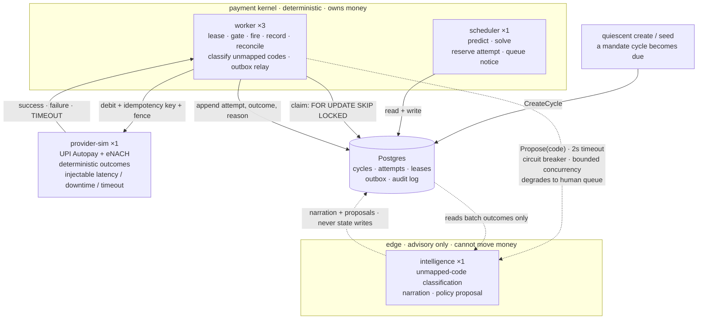

# Architecture — quiescent

*Single Go binary. Four roles. Six processes.*

---

## 1. Shape of the system

One Go module. One build. One executable, `quiescent`. A Cobra subcommand
selects behaviour at startup — four subcommands run forever as independent
processes; the rest run once and exit.

```
quiescent scheduler         ×1
quiescent worker            ×3
quiescent intelligence      ×1
quiescent provider-sim      ×1
```

Six processes at runtime. Every boundary exists because a specific failure
mode required it — none exist by convention.

| Boundary | Why it exists |
|---|---|
| scheduler ↔ worker | Scheduling is idempotent; execution is not. Separating them keeps the dangerous property contained. |
| worker ↔ worker (×3) | The lease-expiry race is *unreachable* with one worker. Concurrency must be real to be proven. |
| kernel ↔ intelligence | An LLM stall must not starve the execution thread pool. |
| kernel ↔ provider-sim | Network timeouts must be genuine, so `unknown` states are real rather than mocked. |

Everything else lives in one process.

**Two categories of boundary.** scheduler↔worker and kernel↔intelligence are
*containment* boundaries — something bad exists on one side and is stopped from
spreading. worker↔worker and kernel↔provider-sim are *reproduction* boundaries
— nothing is contained; they exist so a real-world condition can occur inside
the test environment.

---

## 2. Process topology



The AI-classify call is made by the **worker**, not the scheduler — an
unmapped failure code is only discovered the moment a real debit outcome
comes back, which happens on the execution side, not the planning side.

Every dotted edge is advisory and can fail without stopping a debit. Solid
lines are the money path.

**Not microservices, deliberately.** Microservices solve an organisational
problem — independent teams shipping without coordinating deploys. That force
does not exist for a single engineer. Worse, splitting the money path across
network boundaries would introduce internal unknown-outcome ambiguity:
manufacturing the exact problem this system exists to eliminate.

---

## 3. Roles

### `scheduler` (×1) — decides, never executes

**Forbidden: touching the provider.** It has no provider client. A debit fired
from the scheduler would bypass the lease, the fence, the write-ahead record,
and the notice gate — all four protections at once.

1. Load a cycle due for a scheduling decision — **excluding any in `unknown`
   or `held`**
2. Check attempt budget, atomically, before anything else
3. Classify the last failure code against the deterministic table (pure,
   no I/O — an unmapped code is handled later, by the worker, once a real
   outcome exists to classify)
4. Predict funds-availability / a preferred hour from customer history
5. Solve constraints → a concrete `scheduledFor` that respects the blocked
   windows *and* leaves real room for the 24h pre-debit notice, or "no
   viable slot"
6. **Reserve budget, insert the attempt, and queue the pre-debit notice — in
   one transaction**

Single instance. If it dies, nothing is scheduled until restart, but nothing is
lost: every reservation is durable before the process moves on.

### `worker` (×3) — executes, never decides

**Forbidden: choosing whether or when.** It receives an attempt that already
specifies what to fire and at what time. The one exception is *refusal*: it
re-validates before firing and can veto. Vetoing is not deciding.

1. Claim a due attempt — `SELECT … FOR UPDATE SKIP LOCKED`, rate-limited
2. **Staleness check** — if badly overdue, return to the scheduler to re-solve
3. Acquire the cycle lease, capturing the fence **once**
4. Re-validate mandate state — a decision made three days ago may be illegal now
5. **Notice gate** — verify the pre-debit notice was delivered; if not, abort
6. Write the attempt record **before** firing
7. Fire the debit with an idempotency key and the captured fence
8. Record the outcome, or transition to `unknown` on timeout
9. **On a failure code the deterministic table doesn't cover, ask
   `intelligence`** (2s timeout; failure or low confidence → human queue) —
   this is the one point where the worker consults the AI, since an
   unmapped code is only ever discovered once a real outcome exists
10. Run the reconciliation loop for cycles in `unknown`
11. Run the outbox relay for undelivered notices past `deliverBy`

Three instances so lease contention is real. Kill one mid-debit and the others
must handle it correctly — that is the demo.

### `intelligence` (×1) — advises, never acts

**Forbidden: writing anything.** No database credentials at all — not even
read-only. No provider client. No store interface. It receives values in
memory (a failure code, an aggregated batch of outcomes) and returns a
value; it never queries Postgres itself.

- Classify failure codes the deterministic table does not cover, with confidence
- Narrate audit trails into human-readable explanations
- Propose policy changes from batch outcomes, for human approval

**Forbidden: being required.** Every call has a bounded timeout (2s), a circuit
breaker, bounded concurrency (max 2 in flight, queue depth 10), and a defined
fallback. If the answer is ever "we couldn't proceed because the AI was slow,"
the design is wrong.

### `provider-sim` (×1) — refuses, never forgives

**Forbidden: being lenient.** A lenient simulator makes the system look correct
when it isn't.

- Distinct code sets, windows and costs per rail
- **Deterministic outcomes** — a pure function of `(seed, cycleID, attemptNumber)`,
  never of which policy is asking (common random numbers)
- Fence enforcement — reject anything *lower* than the highest seen, `<` not `<=`
- Idempotency — same key returns the original outcome without reprocessing;
  same key with a different request hash returns a conflict
- Per-customer balance timelines
- Oracle endpoint — true probabilities, exposed to the **harness only**
- Injection: `timeoutAfterCommit`, `timeoutBeforeCommit`, `downtime`,
  `latency`, `revokeMandate`

Its most important behaviour is **timeout-after-commit**: debit the account,
then drop the connection. That is the only way to produce a genuine `unknown`
where money actually moved.

---

## 4. Package layout

```
cmd/quiescent/              Cobra command wiring, config, one file per subcommand

internal/
  domain/                 types, states, interfaces. IMPORTS NOTHING.

  classify/               deterministic code → class. pure.
  predict/                funds-availability from history. pure.
  solve/                  constraints → scheduledFor. pure.
  schedule/               scheduler role

  execute/                worker role: lease, gate, fire, record, classify
  reconcile/              unknown resolution
  outbox/                 notice relay + delivery gate

  lease/                  acquisition, fencing, expiry
  store/                  Postgres. THE ONLY package that talks to the DB.
                          (append-only decision log lives here too —
                          AppendAudit/AuditByCycle — a standalone audit/
                          package would only wrap those two functions)

  intelligence/           LLM client. THE ONLY package importing an LLM SDK.
  provider/               simulator + client

  harness/                batch runner, baseline, oracle, fault injection
```

`domain` imports nothing; everything imports it, so no cycles are possible.

`classify`, `predict` and `solve` have **no I/O**. Function in, function out.
Thousands of property-test runs take seconds instead of minutes.

### The compile-time boundary

```go
package domain

type Classifier interface {
    Propose(ctx context.Context, code FailureCode, data ClassificationContext) (Proposal, error)
}

type Proposal struct {
    Class      FailureClass
    Confidence float64
    Rationale  string
}
```

It takes only values and returns only a value. No `Store`, no `Executor`, no
`LeaseManager`. It cannot write cycle state, reserve an attempt, or call the
provider — not by policy, but because those types are not in scope.
**Attempting it fails to compile.**

Stronger than a microservice boundary, where isolation depends on which
credentials sit in which config file at deploy time. Config drifts; types do
not.

---

## 5. Data model

```sql
CREATE TABLE mandate_cycles (
    cycle_id        UUID PRIMARY KEY,
    mandate_id      UUID NOT NULL,
    customer_id     UUID NOT NULL,
    rail            TEXT NOT NULL,        -- upi_autopay | enach
    amount_paise    BIGINT NOT NULL,
    due_date        DATE NOT NULL,
    attempts_used   SMALLINT NOT NULL DEFAULT 0,
    state           TEXT NOT NULL,
    disposition     TEXT,
    version         BIGINT NOT NULL DEFAULT 0,
    updated_at      TIMESTAMPTZ NOT NULL DEFAULT now(),
    CONSTRAINT budget_cap   CHECK (attempts_used <= 4),
    -- the other end of the same limit: the notice gate (6.6) and the
    -- staleness policy (7) both refund by decrementing
    CONSTRAINT budget_floor CHECK (attempts_used >= 0)
);

CREATE TABLE attempts (
    attempt_id      UUID PRIMARY KEY,
    cycle_id        UUID NOT NULL REFERENCES mandate_cycles,
    seq             SMALLINT NOT NULL,
    idempotency_key TEXT NOT NULL UNIQUE,
    fence           BIGINT,               -- captured at lease acquisition
    scheduled_for   TIMESTAMPTZ NOT NULL,
    fired_at        TIMESTAMPTZ,
    outcome         TEXT,                 -- NULL = in flight
    failure_code    TEXT,
    decision_reason JSONB NOT NULL,
    UNIQUE (cycle_id, seq)
);

CREATE INDEX attempts_due ON attempts (scheduled_for) WHERE outcome IS NULL;

-- single source of truth for the fence
CREATE TABLE leases (
    cycle_id   UUID PRIMARY KEY REFERENCES mandate_cycles,
    holder     TEXT,                      -- NULL = unheld
    fence      BIGINT NOT NULL DEFAULT 0,
    expires_at TIMESTAMPTZ NOT NULL DEFAULT 'epoch'
);

CREATE TABLE outbox (
    id           BIGSERIAL PRIMARY KEY,
    cycle_id     UUID NOT NULL REFERENCES mandate_cycles,
    attempt_id   UUID NOT NULL REFERENCES attempts,
    kind         TEXT NOT NULL,           -- pre_debit_notice | escalation
    payload      JSONB NOT NULL,
    deliver_by   TIMESTAMPTZ NOT NULL,
    delivered_at TIMESTAMPTZ,
    attempts     SMALLINT NOT NULL DEFAULT 0
);

CREATE INDEX outbox_pending ON outbox (deliver_by) WHERE delivered_at IS NULL;

-- the notice gate (6.6): runs before every debit, so it is on the hot path.
-- outbox_pending cannot serve it — that index is keyed on deliver_by and
-- partial on undelivered rows, which is the opposite of what the gate reads.
CREATE INDEX outbox_notice_lookup ON outbox (attempt_id, kind);

CREATE TABLE audit_log (
    id             BIGSERIAL PRIMARY KEY,
    cycle_id       UUID NOT NULL,
    correlation_id UUID NOT NULL,
    at             TIMESTAMPTZ NOT NULL DEFAULT now(),
    event          TEXT NOT NULL,
    inputs         JSONB NOT NULL,
    decision       JSONB NOT NULL,
    reason         TEXT NOT NULL
);
```

### Lease seeding — structural, not conventional

```sql
CREATE FUNCTION seed_lease() RETURNS trigger AS $$
BEGIN
  INSERT INTO leases (cycle_id) VALUES (NEW.cycle_id);
  RETURN NEW;
END $$ LANGUAGE plpgsql;

CREATE TRIGGER seed_lease_on_cycle
  AFTER INSERT ON mandate_cycles
  FOR EACH ROW EXECUTE FUNCTION seed_lease();
```

Defaults give `fence = 0`, `holder = NULL`, `expires_at = 'epoch'`. The first
worker to claim matches `expires_at < now()` and takes fence 1. A cycle without
a lease row cannot exist, regardless of which code path created it — production
ingestion, a test fixture, or a seed script.

### `updated_at` maintenance — a trigger, not a convention

```sql
CREATE FUNCTION touch_updated_at() RETURNS trigger AS $$
BEGIN
  NEW.updated_at := now();
  RETURN NEW;
END $$ LANGUAGE plpgsql;

CREATE TRIGGER touch_mandate_cycles_updated_at
  BEFORE UPDATE ON mandate_cycles
  FOR EACH ROW EXECUTE FUNCTION touch_updated_at();
```

Invariant 3 (orphan detection) reads `updated_at` and nothing else. Defaulting
it at insert and leaving maintenance to the application means a single missed
assignment reports false orphans forever, and a single spurious assignment on a
path that changed nothing hides a real one. The trigger removes the discipline
requirement from every write path, including the ones not yet written.

`now()` is transaction start time, so every row touched by one transaction
agrees on when it changed.

### `decision_reason` — structured, not prose

```json
{
  "failureCode":     "INSUFFICIENT_FUNDS",
  "class":           "retry_later",
  "classifiedBy":    "table",
  "confidence":      null,
  "predictedFunds":  "2026-03-08",
  "predictionBasis": "4_of_5_cycles_succeeded_day_8",
  "constraints": {
    "blockedWindowShift": "10:30 -> 18:00",
    "noticeDeadline":     "2026-03-07T18:00Z",
    "railRules":          "upi_autopay"
  },
  "budgetBefore": 1,
  "budgetAfter":  2
}
```

Input to both the narration layer and the metrics. Free text drifts into four
phrasings of the same reason by day three; a fixed shape stays queryable.

### Invariants pushed into the storage layer

`CHECK (attempts_used <= 4)` puts the regulatory limit where application bugs
cannot reach it. `CHECK (attempts_used >= 0)` closes the other end: two paths
refund budget by decrementing, and a double refund would otherwise manufacture
attempts out of nothing — invariant 2 tests only `> 4`, so it would never fire.

The `seed_lease` trigger makes "cycle without lease" unrepresentable.
`touch_updated_at` does the same for "row changed but `updated_at` did not",
which invariant 3 depends on entirely.

All four follow one principle: **simplify state until the bug cannot be
expressed.**

### Why Postgres and not Redis for the lease

Redis-based distributed locks are the canonical example of unsafe locking under
GC pauses and clock skew — Kleppmann's Redlock critique is specifically about
the missing fencing token. Postgres provides atomic compare-and-set, a
monotonic fence, and a *single shared clock* in one statement.

---

## 6. The six mechanisms

### 6.1 Atomic budget reservation + attempt + notice

Two workers must never both conclude an attempt remains — and a crash must
never burn a budget slot with no attempt row to show for it.

```sql
BEGIN;
  UPDATE mandate_cycles
     SET attempts_used = attempts_used + 1,
         version       = version + 1,
         state         = 'scheduled'
   WHERE cycle_id = $1
     AND version  = $2
     AND attempts_used < 4
  RETURNING attempts_used;        -- 0 rows → ROLLBACK, do not schedule

  SELECT count(*) FROM attempts WHERE cycle_id = $1;   -- seq = this + 1

  INSERT INTO attempts
    (attempt_id, cycle_id, seq, idempotency_key, scheduled_for, decision_reason)
  VALUES ($3, $1, $seq, $4, $5, $6);        -- idempotency_key computed in Go

  INSERT INTO outbox (cycle_id, attempt_id, kind, payload, deliver_by)
  VALUES ($1, $3, 'pre_debit_notice', $7, $5 - interval '24 hours');
COMMIT;
```

Compare-and-set, not read-then-write. Zero rows means the budget is spent or
another writer won — either way you do not fire.

The idempotency key is computed **in Go**
(`domain.NewIdempotencyKey(cycleID, seq)`), bound as a parameter — never
concatenated in SQL, since `provider` already computes the same format
independently and the two must never drift apart.

**`seq` comes from a count of every attempt row ever inserted for this
cycle — not from `attempts_used`.** The two look interchangeable but
aren't: `attempts_used` is refundable (an abandoned, notice-missed attempt
gives its slot back), while `attempts` is append-only, so its idempotency
key stays permanently claimed. Deriving `seq` from the refundable counter
means a refund-then-reschedule recomputes a seq number that's already
taken, and the insert collides forever. Found live, 2026-09-05 — see
`docs/JOURNAL.md`.

Four statements, one transaction. Separate them and a crash partway through
burns budget silently, schedules a debit with no notice queued, or reuses a
sequence number that's already taken.

**Claim:** `attempts_used` never exceeds 4 under any interleaving, never
advances without a corresponding attempt row, no attempt exists without a
queued notice, and no two attempts on the same cycle ever share a sequence
number, no matter how many times one gets abandoned and refunded.

### 6.2 Lease acquisition with fencing token

The fence lives in **one place only** — the lease row. Two sources of truth was
the original bug: incrementing a counter on `mandate_cycles` before knowing
whether the lease was acquired handed a token to a worker that did not hold it.

```sql
UPDATE leases
   SET holder     = $2,
       fence      = fence + 1,
       expires_at = now() + interval '30 seconds'
 WHERE cycle_id   = $1
   AND expires_at < now()
RETURNING fence;
```

One statement. The row lock serialises contenders. The fence increments **only**
on successful acquisition. Zero rows means unambiguously "you do not hold it" —
with no token in hand to misuse.

`now()` is Postgres's clock, so every worker evaluates expiry against *the same
clock*. Cross-machine skew is structurally impossible, not merely mitigated.

Reconciliation uses the same statement with a **5-minute** duration, since
backoff-and-retry on the status query can outlast 30 seconds. Renewal would
require a heartbeat mechanism the system does not otherwise need; the cost of a
stuck reconciliation lease is latency, not correctness.

**INVARIANT — non-negotiable:** the fence is captured **once** at acquisition
and carried in memory. A worker must never re-read it before firing. A stalled
worker that re-reads gets a fresh number and defeats fencing entirely. The
fence is a property of *the moment you acquired the lease*, not of the cycle.

### 6.3 Fence enforcement at the receiver

```go
if req.Fence < highestSeen[req.CycleID] {
    return ErrStaleFence          // the stalled worker is stopped HERE
}
highestSeen[req.CycleID] = req.Fence
```

Worker A holds fence 7, stalls, its lease expires. Worker B takes fence 8 and
debits. A wakes and fires with 7 — **the provider rejects it**. Prevented at
the receiver, which is the only place it *can* be prevented: A cannot know it
stalled, B does not know A exists, and only the provider sees both.

`<` not `<=`. A legitimate holder retrying after a transient network error
carries the *same* fence and must be accepted.

### 6.4 Write-ahead attempt record

The attempt row is inserted with `outcome = NULL` **before** the debit is sent.

Crash between insert and send → recovery finds an attempt with no outcome and
reconciles. Crash after send but before recording → same path, same handling.
Both are indistinguishable from the log, which is correct: they *are*
indistinguishable in reality. **The log records what you knew, not what
happened.**

Write after firing instead, and a crash leaves no evidence the attempt
happened. Recovery re-fires. That is the double-debit.

### 6.5 Reconciliation, never blind retry

No transition from `unknown` back to `in_flight`. On timeout the worker queries
the provider by idempotency key — a pure read, safe to repeat, and it does not
consume attempt budget.

| Answer | Transition |
|---|---|
| Debited | `recovered` |
| Not debited | `pending`, budget intact |
| Still unknown after N retries | `held` — stop, flag for human |

**Reconciliation acquires the lease first.** Any operation that transitions
cycle state takes the lease; otherwise three workers reconcile the same cycle
concurrently and all three push it to `pending`.

**The scheduler's claim query excludes `unknown` and `held`** — otherwise you
double-debit through the front door while reconciliation is pending. A state
machine drawn on paper is a description; a state machine enforced in queries is
a constraint.

**The underlying truth:** exactly-once does not exist across a network
boundary. You choose at-least-once with an idempotent receiver, or at-most-once
with reconciliation. This system chooses reconciliation for money movement.

### 6.6 Outbox — notice written transactionally, delivered separately

The pre-debit notice row is written in the same transaction as the budget
reservation (6.1). A relay loop in the worker polls undelivered rows past
`deliverBy`, delivers, and marks them.

Before firing, the executor **gates on delivery**:

```sql
SELECT delivered_at FROM outbox
 WHERE attempt_id = $1 AND kind = 'pre_debit_notice';
```

Not delivered → abort, return the attempt to the scheduler, **refund the
budget** (guarded on `fired_at IS NULL`). Nothing was sent, so nothing was
spent.

Without the outbox: write the attempt, then call the notification service.
Crash between → an attempt scheduled with no notice sent, fired the next day,
compliance violated silently. Reverse the order and you notify a customer about
a debit that was never scheduled.

This is also what makes `PRE_DEBIT_NOTICE_MISSING` a real code the system can
produce, rather than a table entry nothing generates.

---

## 7. Thundering-herd control

Workers restart after an outage. Four hundred durable timers are simultaneously
overdue. Fire them at once and you trip the provider's rate limit, receive four
hundred technical declines, and **burn four hundred attempts** — a quarter of
the recovery budget across four hundred cycles, destroyed *by recovering*.

Three controls, in order of importance:

**Rate limit.** Token bucket in the claim loop, capped below the provider's
limit. `golang.org/x/time/rate`. Ten lines, and it alone prevents the disaster.

**Staleness policy.** An attempt scheduled for the 8th at 18:00, now firing at
20:30 on the 9th, was scheduled for a reason that may no longer hold — a
predicted salary date, a slot chosen to avoid a blocked window. Past the
threshold, return it to the scheduler to re-solve against current time.

```
outcome = 'ABANDONED_STALE', budget refunded, guarded on fired_at IS NULL
```

Never delete the row. `attempts` is append-only; invariant 4 excludes stale
rows from its count.

**Jitter.** Spread claims over a window. Two lines. Smaller win here than in a
many-worker system, since `SKIP LOCKED` already reduces contention, but free.

The staleness policy is the interesting one: it recognises that a stale
schedule is a *wrong* schedule, not merely a late one.

---

## 8. Failure isolation

| Process dies | Stops | Blast radius | Anything incorrect? |
|---|---|---|---|
| `scheduler` | New scheduling | System-wide, temporary | No — reservations were durable |
| One `worker` | Nothing | One cycle, ≤30s | No — lease expires, higher fence takes over |
| All `workers` | Execution | System-wide; **thundering herd on restart** | No, but attempts can be wasted without §7 |
| `intelligence` | AI classification, narration | Unmapped codes only | No — circuit breaker, human queue fallback |
| `provider-sim` | Debits | All in-flight → `unknown` | No — reconciliation resolves on recovery |
| Postgres | Everything | Total | No — no state means no safe action |

**The last column is the claim.** Every failure degrades availability. None
produces incorrectness.

What makes each row safe is the same thing: **nothing that matters lives in
memory.** No in-memory queue, no cached budget, no worker-local state a
correctness decision depends on. The one exception — the fence held in memory
during a debit — is precisely the thing that *should* die with the process.

---

## 9. Deployment

`docker-compose.yml` runs Postgres only — the four long-running roles are
plain OS processes, one per terminal, sharing the same `DB_URL`:

```
docker-compose up -d                 # Postgres
go build -o quiescent.exe ./cmd/quiescent

quiescent provider-sim                # terminal 2
quiescent scheduler                   # terminal 3
quiescent worker                      # terminal 4, run three times for ×3
quiescent intelligence                # terminal 5
```

Kill and restart a `worker` process mid-debit for the crash demo — the same
effect the compose-service version would have had, without needing the app
itself containerized.

---

## 10. Fault injection surface

Not a test suite bolted on at the end — the deliverable that produces the
"what broke" story. **Each mechanism gets its injection test the same day it is
built.**

- **Provider-side injection**, over the simulator's own `/inject` endpoint —
  `timeoutAfterCommit`, `timeoutBeforeCommit`, `downtime`, `latency`,
  `revokeMandate`, scopable to one cycle with an optional request count
- **Crash points reproduced directly in Go tests**, not via an env-var
  switch on the real binary — a helper stops execution at the exact point a
  real crash would (fired, bank asked, outcome never recorded), which is
  how `TestC3ReconciliationCatchesAGenuineProcessCrashNotJustAnExplicitTimeout`
  and the C4 stalled-worker tests are built
- Restart the scheduler with a large overdue backlog — the thundering-herd
  scenario in §7
- Revoke a mandate between scheduling and firing
- Kill the outbox relay — attempts come due, the notice gate holds, nothing
  fires

### Invariants — every run, every injection point

```sql
-- 1. Nobody charged twice
SELECT cycle_id FROM attempts WHERE outcome='SUCCESS'
 GROUP BY cycle_id HAVING count(*) > 1;

-- 2. Regulatory limit held
SELECT cycle_id FROM mandate_cycles WHERE attempts_used > 4;

-- 3. Nothing orphaned
SELECT cycle_id FROM mandate_cycles
 WHERE state NOT IN ('recovered','escalated','abandoned','held')
   AND updated_at < now() - interval '1 hour';

-- 4. Budget agrees with fired attempts (excludes stale, never-fired)
SELECT c.cycle_id FROM mandate_cycles c
 WHERE c.attempts_used <> (
   SELECT count(*) FROM attempts a
    WHERE a.cycle_id = c.cycle_id
      AND (a.outcome IS NULL OR a.outcome <> 'ABANDONED_STALE'));

-- 5. No attempt fired into either blocked window (the windows are an IST
--    fact; fired_at is timestamptz and a bare ::time renders it in whatever
--    the session TimeZone happens to be — under UTC this checked the wrong
--    hours entirely and returned zero rows for the wrong reason)
SELECT attempt_id FROM attempts
 WHERE (fired_at AT TIME ZONE 'Asia/Kolkata')::time BETWEEN '10:00' AND '13:00'
    OR (fired_at AT TIME ZONE 'Asia/Kolkata')::time BETWEEN '17:00' AND '21:30';

-- 6. No attempt fired without a notice delivered at least 24h ahead. LEFT
--    JOIN, with `kind` in the ON clause — an inner join sees only attempts
--    that already have a notice row, so it catches "queued but undelivered"
--    and goes blind to "never queued at all", which is the severe case.
--    Moving `kind` to WHERE converts it back into an inner join and
--    reintroduces exactly that. The second OR condition catches a notice
--    that *was* delivered, but too close to firing to count as real notice.
SELECT a.attempt_id FROM attempts a
  LEFT JOIN outbox o
    ON o.attempt_id = a.attempt_id AND o.kind = 'pre_debit_notice'
 WHERE a.fired_at IS NOT NULL
   AND (o.delivered_at IS NULL OR o.delivered_at > a.fired_at - interval '24 hours');
```

All six return **zero rows**. The correctness claim is not a log line saying
OK — it is a query anyone can run and see nothing come back.

**Invariant 4 is the one that catches the silent budget burn.** Invariants 1
and 2 check that individual facts are legal; 4 checks that two facts *agree*.
Every duplicated fact needs one of these.

### Property-based extension

```go
quick.Check(func(seed int64) bool {
    RunScenario(GenerateScenario(seed))
    return CheckInvariants()
}, &quick.Config{MaxCount: 5000})
```

Five thousand random scenarios; any failure returns a seed that reproduces it
exactly. Viable only because `classify`, `predict` and `solve` have no I/O.

---

## 11. Measurement

Two comparators, not one:

- **Baseline** — fixed 24h/72h/168h schedule, no classification, no
  prediction, no constraint awareness. ~50 lines.
- **Oracle** — reads true probabilities from `provider-sim`. Not deployable.
  The upper bound.

Report **"captured X% of achievable lift"**, not a raw recovery rate. A raw
rate says nothing; a fraction of a known ceiling bounds what was possible.

**Common random numbers throughout.** Outcomes are a pure function of
`(seed, cycleID, attemptNumber)` — never of which policy is asking. When two
policies make the same choice they get the same result, so differences are
attributable to decisions rather than luck.

200 seeds, paired confidence intervals.

---

## 12. Stated boundaries

- **One binary, not microservices.** The organisational force that justifies
  service splits does not exist for a single engineer. Splitting the money path
  across network boundaries would manufacture the exact ambiguity this system
  exists to eliminate.
- **Process boundaries where a failure domain required one.** Intelligence
  isolated so LLM latency cannot starve execution; workers separate so lease
  contention is real; provider separate so timeouts are genuine.
- **The LLM cannot authorise a debit.** Enforced at compile time by interface,
  not at deploy time by credentials.
- **Postgres for leases, not Redis.** Fencing requires a monotonic counter with
  atomic CAS and a shared clock.
- **One source of truth per invariant.** The fence lives in the lease row
  alone; the budget in `mandate_cycles` alone, guarded by a schema CHECK.
  Duplicated state caused the original lease bug — the fix was not adding a
  guard, it was making the bug unrepresentable.
- **`attempts` is append-only.** Mark, never delete. Mutable state tells you
  where you are; append-only state tells you how you got there.
- **No workflow engine.** A durable execution engine is the project, not a
  dependency.
- **Not built:** real bank integration, mandate registration, message delivery,
  multi-tenancy, authentication. Each is solved elsewhere and none would
  demonstrate anything this project claims. See `NON-GOALS.md`.
